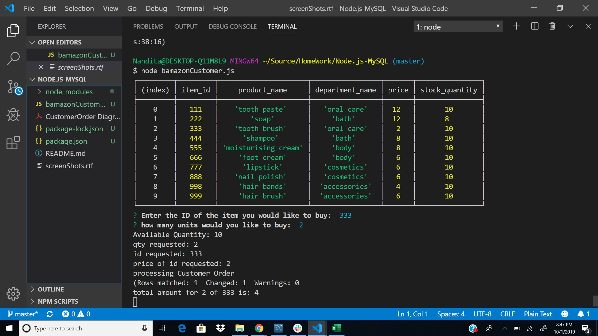

# Node.js-MySQL
# installed mysql and inquirer modules
# connection made to database
# function runProg() display the table-- calls promptUsers
# function promptUsers() prompts for user to enter itemId and quantity
# in the callback, verifies the quantities available and calls customerOrder() to process the customer order
# function CustomerOrder () updates the  quantities in db and prints the tototal amount calls CleanUp() to end dbconnection
*italic* 
**bold**

